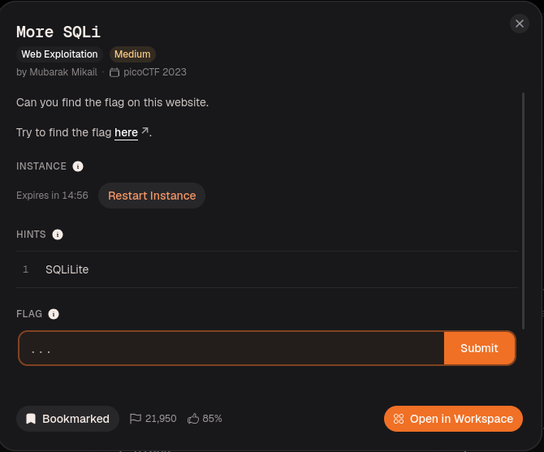
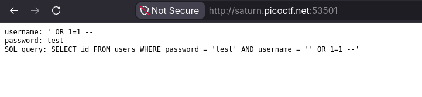
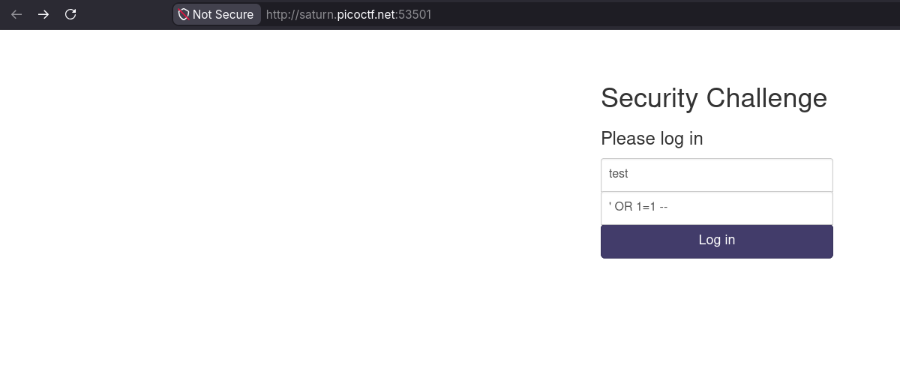
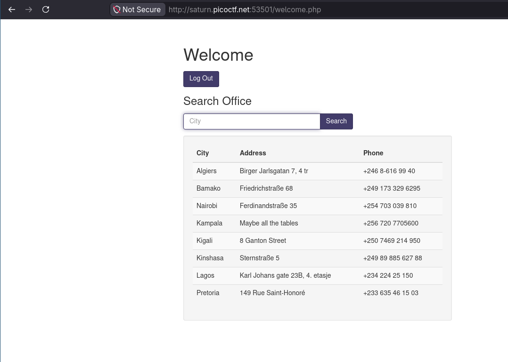
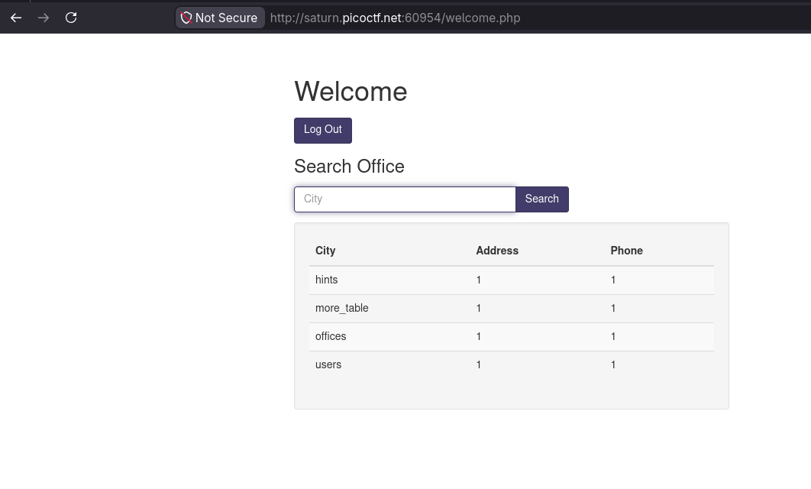
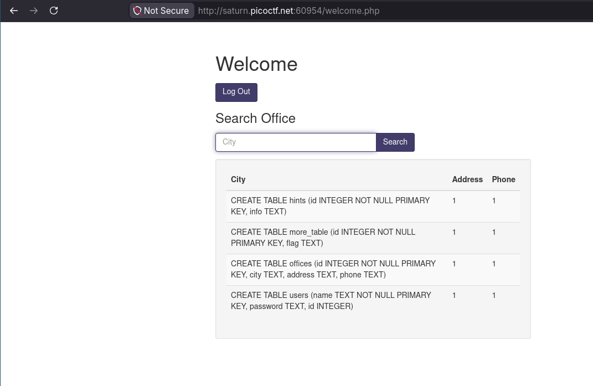
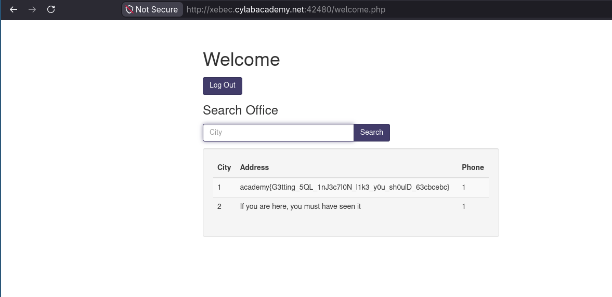
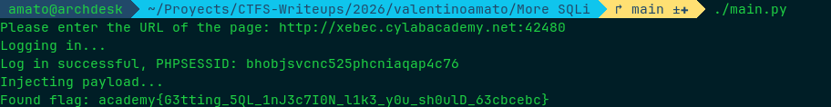

# More SQLi

## Resolución
Para comenzar el reto, creamos una nueva instancia del mismo, desde la página de [CyLab](https://learn.cylabacademy.org/library/358).


Una vez creada la instancia nos dirigimos a la página del reto, donde nos encontramos con un formulario de login.


Si probamos iniciar sesión, la página nos muestra la consulta SQL realizada. Si intentamos realizar una inyección en el parámetro de usuario obtenemos lo siguiente.


Como podemos ver por más de que la inyección sea exitosa, como se evalúa primero la contraseña, el `OR` que inyectamos no logra hacer verdadera la sentencia `WHERE`.

Para solucionar esto, inyectamos el payload en el parámetro de la contraseña.



Lo cual finalmente nos da acceso.



Usando la pista que nos dio el reto, sabemos que el DBMS usado es SQLite, por lo que obtenemos el nombre de las tablas con la siguiente inyección usada en el input de búsqueda.
```sql
' UNION SELECT name, 1, 1 FROM sqlite_master WHERE type='table'--
```

Como sabemos que la consulta original selecciona tres columnas (ciudad, dirección y número), seleccionamos `name, 1, 1` para que funcione correctamente `UNION`.



Ahora realizamos otra inyección para conocer cómo fueron creadas estas tablas.

```sql
' UNION SELECT sql, 1, 1 FROM sqlite_master WHERE type='table'--
```



Como se puede ver, la tabla `more_table` tiene una columna `flag`, así que realizamos otra inyección para ver los contenidos de esta tabla.

```sql
' UNION SELECT id, flag, 1 FROM more_table --
```


Finalmente obteniendo la flag del reto: `academy{G3tting_5QL_1nJ3c7I0N_l1k3_y0u_sh0ulD_63cbcebc}`

## Script
El [script](./main.py) realizado realiza una primera inyección al login, obteniendo una sesión, y luego una segunda inyección para obtener la flag.

