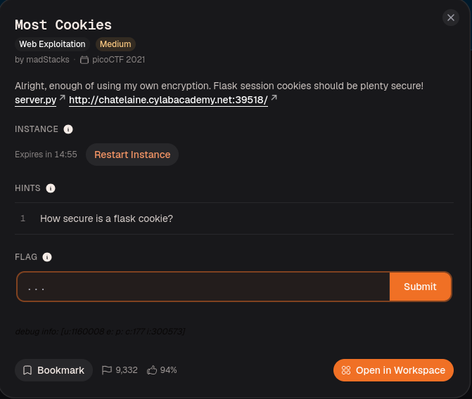
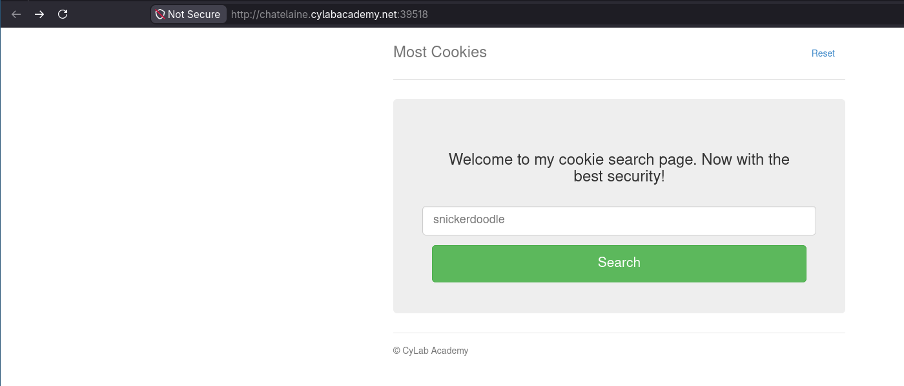
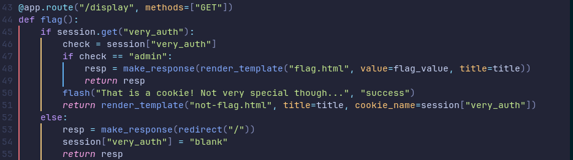
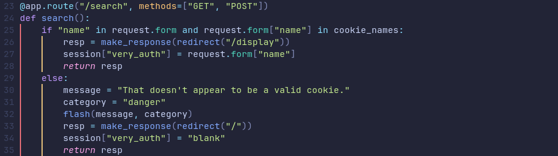
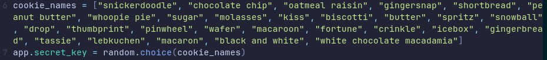
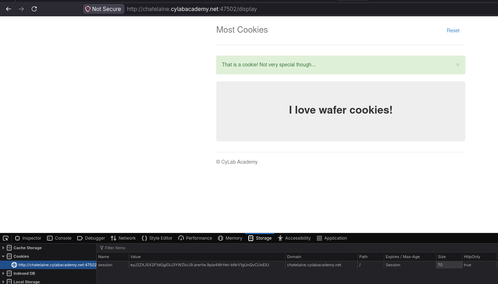
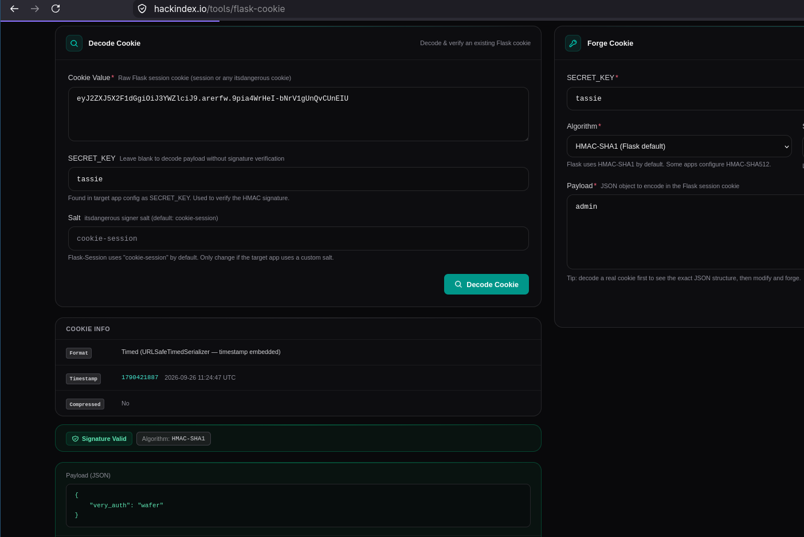
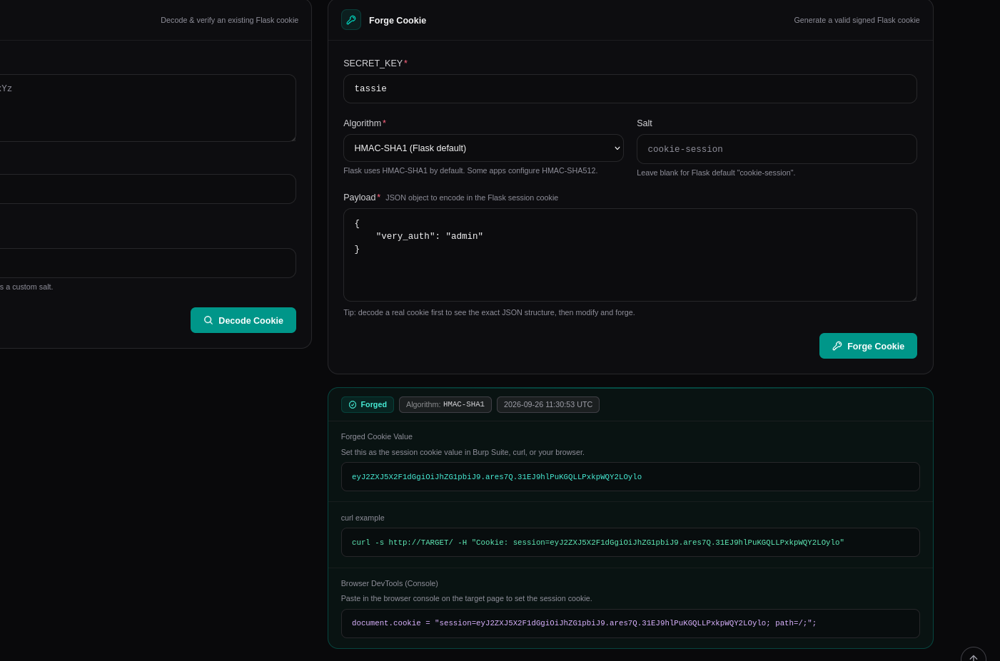
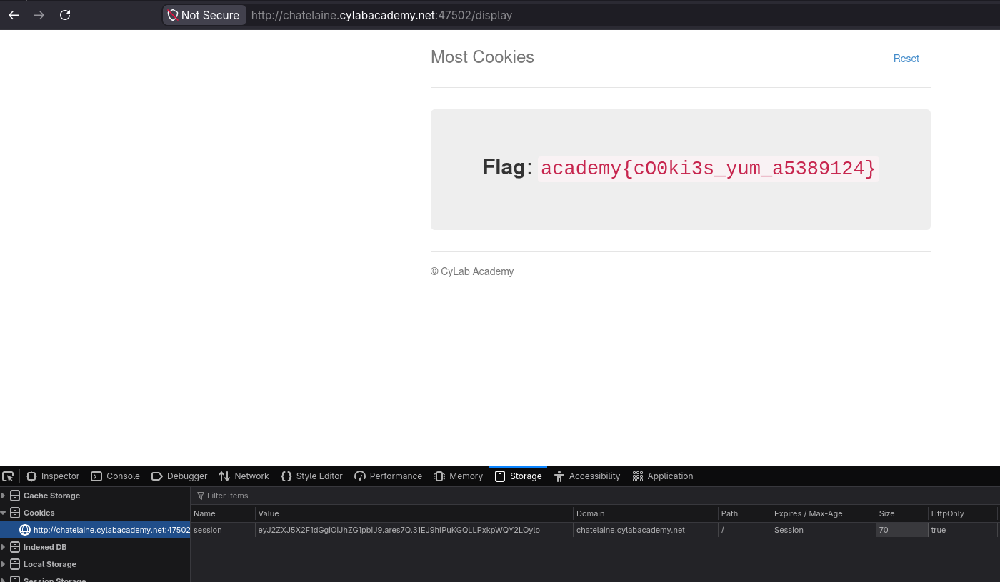

# Most Cookies

## Resolución
Para comenzar el reto, creamos una nueva instancia del mismo, desde la página de [CyLab](https://learn.cylabacademy.org/library/177).

Al crear la instancia, la página nos brinda el código que usa el servidor, [server.py](./server.py).

Nos dirigimos a la página del reto, donde nos encontramos con una página que nos permite buscar galletitas.

Ya que tenemos acceso al [codigo](./server.py) de la página, nos enfocamos directamente en este, en vez de hacer ingeniería inversa.

Podemos ver rápidamente que la función `flag` que responde a la ruta `/display`, renderiza la página `flag.html` solo si el payload de la sesión posee la clave `very_auth` y la misma está asociada al valor `"admin"`.

La cookie de sesión se establece en la función search. Si la galleta buscada está en la lista `cookie_names`, entonces el nombre de la galleta se establece como el valor de `very_auth`.

Si `admin` estuviera en la lista de galletitas, obtener la flag sería tan sencillo como buscar "admin". Pero no lo está, así que debemos buscar otra solución.

Mirando el principio del código nos encontramos la lista de galletitas, y vemos que en la línea que sigue, se selecciona una de ellas de manera aleatoria como `secret_key`.

Si conociéramos cual de ellas es seleccionada, podríamos usar la `secret_key` para construir una cookie de sesión que tenga los parámetros que buscamos.

Primero buscamos una galletita válida, por ejemplo `wafer` y anotamos la cookie de sesión generada.

Luego, con la ayuda de una [herramienta](https://hackindex.io/tools/flask-cookie), intentamos desencriptar la cookie probando las distintas opciones de galletitas como `secret_key`.

Finalmente encontramos que la `secret_key` es `tassie`.

Conociendo la `secret_key`, usamos la misma herramienta para crear la cookie modificada.

Si ahora hacemos una request a `/display` con la cookie generada podemos acceder a la página protegida.

Obteniendo la flag del reto: `academy{cO0ki3s_yum_a5389124}`

