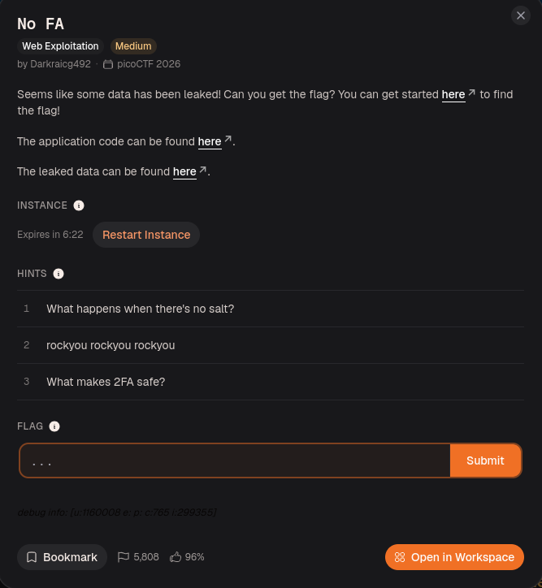
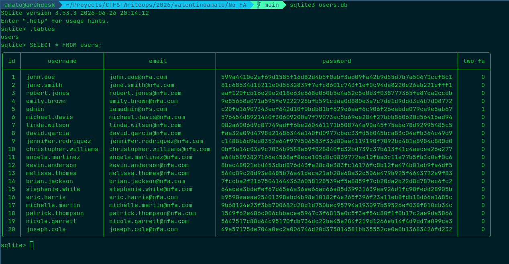
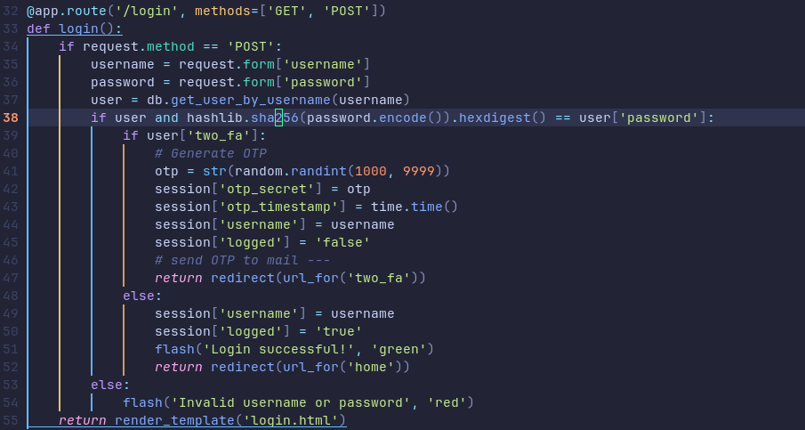
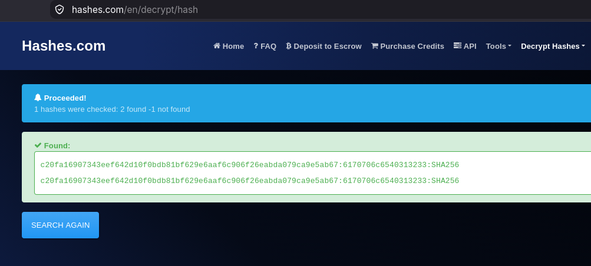
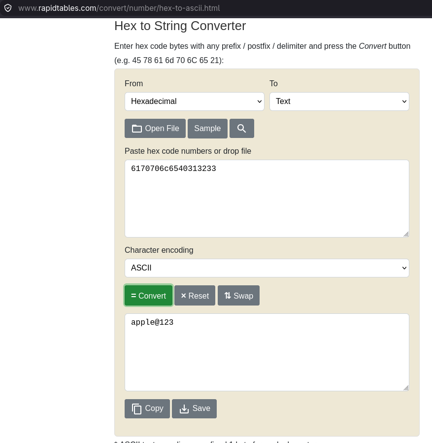
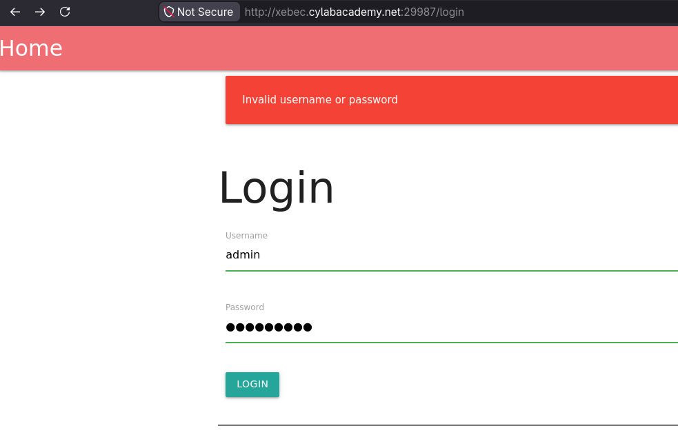
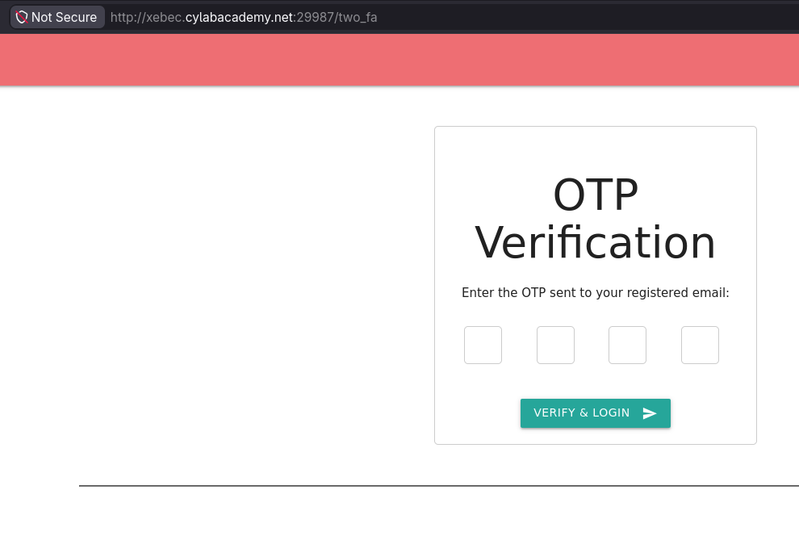
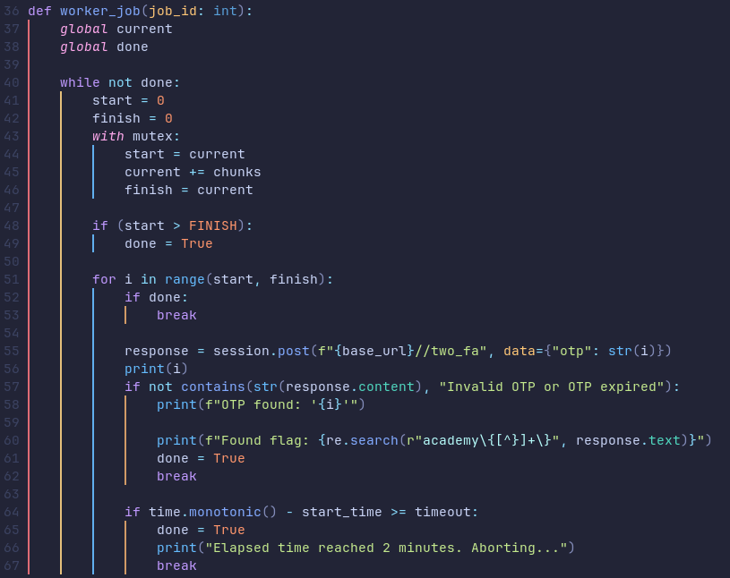
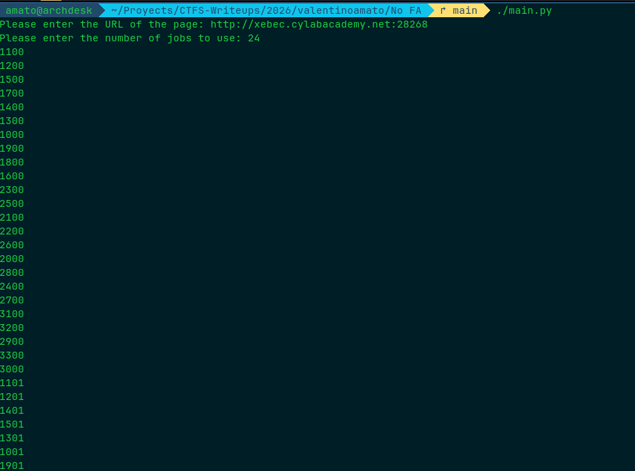
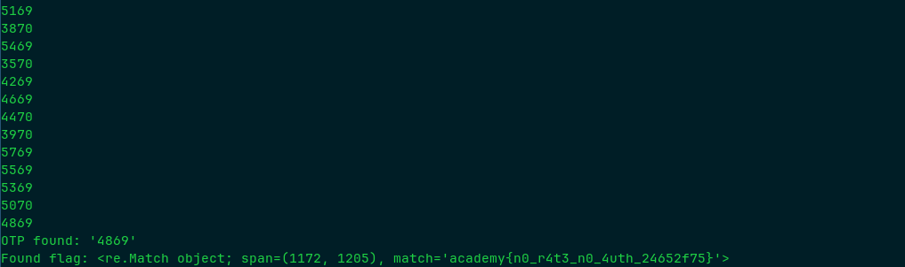

# No FA

## Resolución
Para comenzar el reto, creamos una nueva instancia del mismo, desde la página de [CyLab](https://learn.cylabacademy.org/library/765).

Al crear la instancia, se nos brinda el código que usa el servidor, [app.py](./app.py), y informacion "filtrada", [users.db](./users.db).

Si inspeccionamos `users.db`, encontramos una tabla `users`.

En `app.py` podemos ver que las contraseñas se codifican en hexadecimal y luego se almacena su hash `sha256`.

Como tenemos el hash de la contraseña del admin, primero hacemos una búsqueda inversa usando una [herramienta](https://hashes.com/en/decrypt/hash)

Luego decodificamos el valor obtenido.

Ahora que tenemos la contraseña del admin, nos dirigimos a la página e iniciamos sesión.

Ahora la página nos solicita el código OTP.

Si analizamos la [aplicacion](./app.py), podemos notar que no hay ningún tipo de rate limit. Por lo que utilizaremos un ataque de fuerza bruta para obtener el OTP.

Sabiendo que el OTP es un número entre 1000 y 9999 ([app.py](./app.py#L41)), creamos un script que realice un ataque de fuerza bruta probando distintos valores de OTP hasta encontrar el correcto.

El [script](./main.py) consta de un conjunto de workers que colaboran para probar los distintos posibles OTPs. Si alguno lo encuentra, o se acaba el tiempo (120 segundos), todos los workers terminan.

Al ejecutar el script, este inicia sesión con las credenciales del administrador y comienza inmediatamente el ataque de fuerza bruta.

Luego de unos segundos, el script finaliza, encontrado la flag: `academy{n0_r4t3_n0_4uth_24652f75}`

